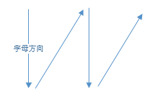

##Z字形变换
###题目描述
将一个给定字符串 s 根据给定的行数 numRows ，以从上往下、从左到右进行 Z 字形排列。

比如输入字符串为 "PAYPALISHIRING" 行数为 3 时，排列如下：
```
P   A   H   N
A P L S I I G
Y   I   R
```
之后，你的输出需要从左往右逐行读取，产生出一个新的字符串，比如："PAHNAPLSIIGYIR"。

请你实现这个将字符串进行指定行数变换的函数：

string convert(string s, int numRows);

示例1:
```示例
输入：s = "PAYPALISHIRING", numRows = 4
输出："PINALSIGYAHRPI"
解释：
P     I    N
A   L S  I G
Y A   H R
P     I
```
示例2:
```示例
输入：s = "PAYPALISHIRING", numRows = 3
输出："PAHNAPLSIIGYIR"
```
示例3:
```示例
输入：s = "A", numRows = 1
输出："A"
```
###分析
按照题目的正向思维,遍历字符串,将每个字符填入对应的行中,注意判断当前行的前进顺序



###解决
```java
public static String convert(String s, int numRows) {
        List<StringBuilder> strs = new LinkedList<StringBuilder>();

        if (numRows == 1) return s;

        //用于访问list的索引
        int rowIndex = 0;
        //控制前进方向
        int giong = 1;
        for (char c : s.toCharArray()) {
            if (strs.size() < rowIndex + 1)
                strs.add(new StringBuilder());
            strs.get(rowIndex).append(c);

            if (rowIndex == 0) giong = 1;
            if (rowIndex == numRows - 1) giong = -1;
            rowIndex += giong;
        }
        //生成最终字符串
        String resString = "";
        for (StringBuilder str : strs) {
            resString += str.toString();
        }
        return resString;
    }
```
###进阶
找寻字符串中字符所在索引和排列后的行列关系，数学推导